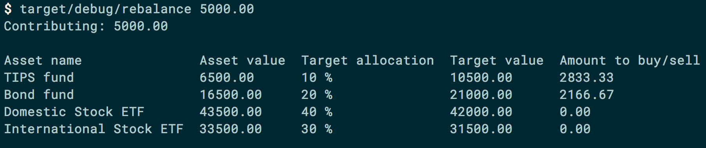

# rebalance-app

[](https://travis-ci.org/dashed/rebalance-app)

> Optimal lazy portfolio rebalancing calculator (in Rust)



## Usage

```
$ rebalance-app --help
rebalance-app 1.2.0
Alberto Leal (github.com/dashed) <mailforalberto@gmail.com>
Optimal lazy portfolio rebalancing calculator

USAGE:
    rebalance-app [OPTIONS] <contribution> --portfolio <FILE> --targets <FILE>

FLAGS:
    -h, --help       Prints help information
    -V, --version    Prints version information

OPTIONS:
    -p, --portfolio <FILE>                 Sets a portfolio file
    -i, --portfolio_value_index <INDEX>    Sets CSV index of the portfolio value
    -t, --targets <FILE>                   Sets a targets file

ARGS:
    <contribution>    Sets the contribution amount
```

### Quickstart

1. Set up `targets.csv`. Example: [example/targets.csv](example/targets.csv)

2. Set up `portfolio.csv`. Usually you export this from your favourite broker. Example: [example/portfolio.csv](example/portfolio.csv)

3. Run: `rebalance-app --portfolio example/portfolio.csv --targets example/targets.csv 5000`

By default, `rebalance-app` assumes the values of your assets in your portfolio CSV file is at the 2nd column (i.e. index 1). For example:

```
Bond fund,                 roi %, ticker symbol, $16500.00
TIPS fund,                 roi %, ticker symbol, $6500.00
Domestic Stock ETF,        roi %, ticker symbol, $43500.00
International Stock ETF,   roi %, ticker symbol, $33500.00
```

You can adjust this using the `-i` flag:

```
rebalance-app -i 3 --portfolio example/portfolio.csv --targets example/targets.csv 5000
```

### About

**Rationale:** Rather than rebalance your portfolio internally, add/remove money such that your asset targets % are achieved as close as possible.

See this article on rebalancing: https://www.bogleheads.org/wiki/Rebalancing

Based on:

- http://optimalrebalancing.tk
- https://github.com/EDawg878/Portfolio-Rebalancer

**How it works:**

Source: [http://optimalrebalancing.tk/explanation.html (archived snapshot)](http://archive.today/IB0hQ)

**Step 1: Calculate How Each Asset Deviates From Its Target**

1. Define the difference between each asset's actual value and its intended portion after factoring in the new contribution. This difference is expressed as a percentage `f`, termed the fractional deviation.
2. Compute `f` as: `f = a/t - 1`, where:
   - `a` is the current value of the asset.
   - `t` is the intended portion of the asset relative to the final total portfolio value, which is obtained by adding the new contribution to the original total portfolio value.

A negative `f` indicates the asset is below its target, while a positive `f` means it's over its target.

**Step 2: Distribute Funds to Assets to Equalize Their Deviations**

1. Start by identifying the group of assets with the most negative (lowest) `f` values, i.e., those furthest below their target.
2. Allocate a portion of the contribution to this group of assets. The goal is to bring their `f` values close to or equal to the next lowest `f` value among the remaining assets.
3. Within this group of most underweight assets, distribute the contribution proportionally based on their target allocations. For instance, if two assets in this group have target allocations of 10% and 20% respectively, and you're adding $30, the first should get $10, and the second should get $20.

4. Repeat steps 1 through 3 until all of the new contribution is distributed across the assets.

# Chores

- `cargo fmt`

# License

GPL-3.0+.
